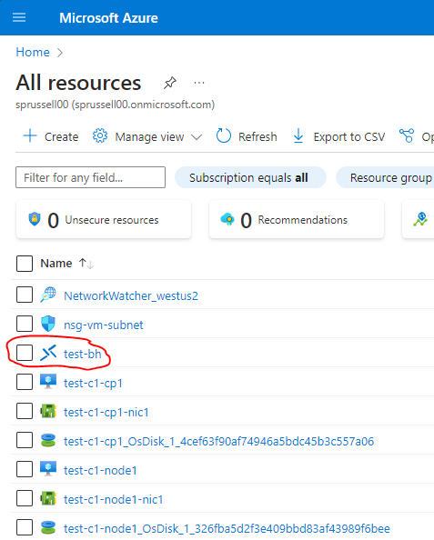
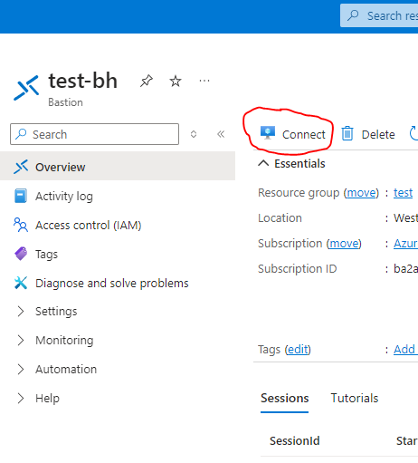

# AWS - Kubernetes Cluster built with the AWS CDK

<h3>Requirements</h3>

CDK uses the AWS CLI so install that first!

<pre>
curl "https://awscli.amazonaws.com/awscli-exe-linux-x86_64.zip" -o "awscliv2.zip"
unzip awscliv2.zip
sudo ./aws/install
</pre>

Run aws configure to configure authentication using keys

Requires Node.js > 10.13

For Ubuntu 24.04:

<pre>
curl -fsSL https://deb.nodesource.com/setup_current.x -o nodesource_setup.sh
sudo -E bash nodesource_setup.sh
sudo apt-get install -y nodejs

# Install the toolkit:
sudo npm install -g aws-cdk
python -m pip install aws-cdk-lib
</pre>

<h4>Preparing an AWS Region for CDK Deployments</h4>

The `cdk-bootstrap` command is used to bootstrap a CDK environments

<pre>
cdk bootstrap account-num/region

Example:
cdk bootstrap 1234567929/us-east-2
</pre>

- Creates a CDK Toolkit stack, buckets, and IAM role

Create a AWS EC2 KeyPair in the AWS Management Console, name it "KubernetesKeyPair"

Download this keypair as a .pem file and store it securely in your ~/.ssh/ folder

Create a self-signed certificate in Certificates Manager, name it "KubernetesCert"

Record the ARN of these certificates

## Running the automation
<pre>$ ansible-playbook automated_install.yml -i localhost,</pre>

<!-- You will be prompted for a region.

The automation will create the resource group resources necessary in Azure to run a 4 node Kubernetes cluster with Dashboard hosting various services offered.

## Accessing the nodes:
Kubernetes nodes will have IP addresses in the range of 10.0.0.4 to 10.0.0.8

Review the output of the automation for the IP address of the nodes.  By default you can SSH to the Kubernetes control plane node using:
<pre>
ssh localhost -p 2224   # for control plane node IP = 10.0.0.4
ssh localhost -p 2225   # for control plane node IP = 10.0.0.5
ssh localhost -p 2226   # for control plane node IP = 10.0.0.6
ssh localhost -p 2227   # for control plane node IP = 10.0.0.7
</pre>

The Jumpbox can be accessed via the Azure Portal

Click on the test-bh Bastion Host

Click on Connect

Enter the IP address of the Windows 10 Jumpbox, enter the service account username and password, and click Connect

 -->
